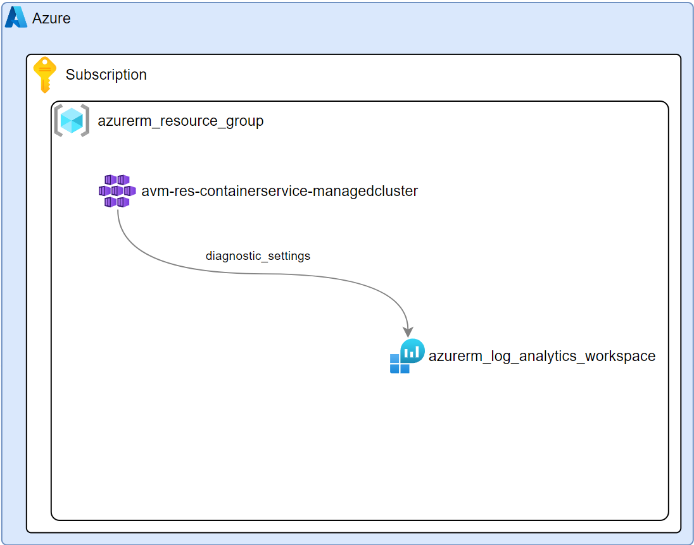
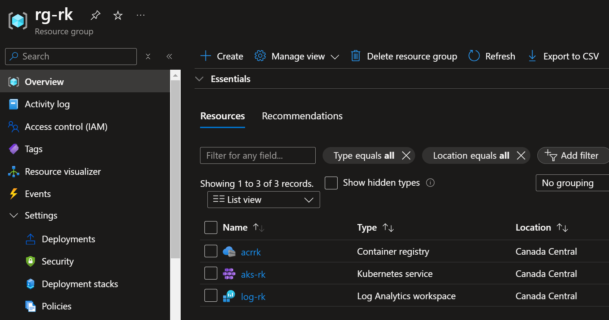
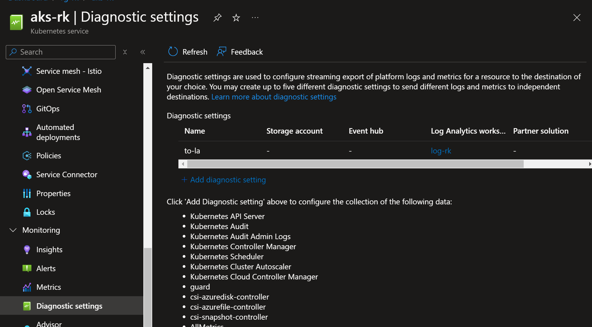

This IAC deployment scenario is to demonstrate The Azure Verified Modules (AVM) for [Azure Kubernetes Service](https://registry.terraform.io/modules/Azure/avm-res-containerservice-managedcluster/azurerm/latest), [Log Analytics Workspace](https://registry.terraform.io/modules/Azure/avm-res-operationalinsights-workspace/azurerm/latest) and [Azure Container Registry](https://registry.terraform.io/modules/Azure/avm-res-containerregistry-registry/azurerm/latest).

* Given a resource group, an Azure Kubernetes Cluster is deployed.
* A Log Analytics workspace is used to collect metrics and logs from both the AKS resource and Azure Container resource. The diagnostic settings of each resource is configured to refernce the log analytics workspace

## Azure Portal Deployment

Resource Group

Azure Kubernetes Service - Diagnostic Settings

Find Terraform AVM Resource Modules [here](https://azure.github.io/Azure-Verified-Modules/indexes/terraform/tf-resource-modules/)