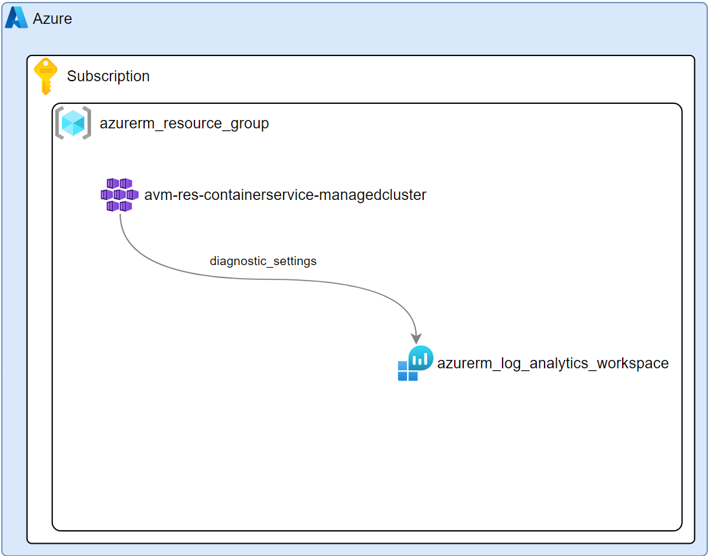

# Objective

This repo is a collection of code samples exhibiting various technical patterns, designs, techniques and scenarios. Some of the code I have adapted from other sources and some code I have developed from scratch with my own style and conventions.

### Purpose and Principles
* Enable you to gain more adoption of various azure terraform deployment scenarios.
* Detailed walkthrough for the novice to be as clear as I can to alleviate any guess work using the code.
* Periodically testing my code every 1-2 months so free from error. Any code that is deprecated or no longer working, I will point it out.
* Code commenting comprehensively to explain how the code works so you have a deeper understanding. 
* Assuming you are novice to intermediate. Evn for the senior experienced engineer, this will help as a refresher and quick reference. 
* Write about specific techniques that are applied in a Infra-As-Code deployment. A technique can be about using a for each loop, repeatable resource tagging and more.

| Code Sample | Description |  |
| ------ | ----------- | ----|
| __[azurerm-tf-starter](https://github.com/RoyKimYYZ/az-terraform-cicd/tree/main/azurerm-tf-starter)__   | As there are many ways to structure a terraform project, I am showing one example for a beginner scenario by deploying a storage account. Along with a blob container wrapped as a terraform module for purposes of reusability and modularity. | |
| __[avm-storage-account-tf](https://github.com/RoyKimYYZ/az-terraform-cicd/tree/main/avm-storage-account-tf)__ | A simple [Azure Verified Module](https://azure.github.io/Azure-Verified-Modules/) [storage account](https://registry.terraform.io/modules/Azure/avm-res-storage-storageaccount/azurerm/latest) deployment with networking options. |
| [avm-aks-example1](/avm-aks-example1-tf)    | A very basic AVM Azure Kubernetes with AVM Log Analytics Workspace |  |
| [avm-aks-example2](/avm-aks-example2-tf)    | An AVM Azure Kubernetes with AVM Log Analytics Workspace and Azure Container Registry. Assign role assignment from AKS to ACR with ACR Pull role  |  |

In the coming months, I plan to add more Infra-As-Code solutions in the form of azure terraform code.

Feedback is welcome as I want to improve the style, organization and the manner of which I show these examples to help the tech community.

